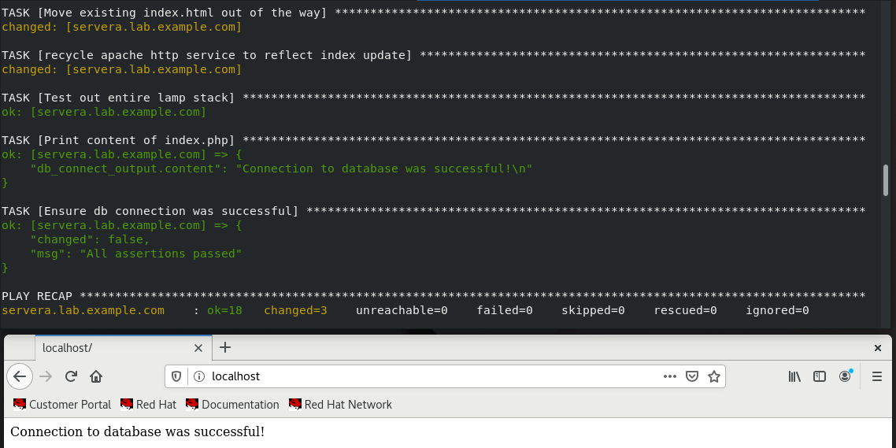

## Prerequisites:
Install ansible on a control node before proceeding.

Official Ansible install reference:
https://docs.ansible.com/ansible/latest/installation_guide/intro_installation.html

## Build Procedure:
1. Add user 'devops' on control node and all managed hosts:  
```shell
useradd devops
```

2. Update password for devops user:  
```shell
passwd devops
```

3. Copy devops_sudo file into /etc/sudoers.d directory to grant devops user passwordless sudo access on control node and all managed hosts:
```shell  
cp files/devops_sudo /etc/sudoers.d
```

4. On control node, switch user to devops:  
```shell  
su - devops
```

5. On control node, create ssh key pair to allow passwordless ssh access:  
```shell 
ssh-keygen
```

6. On control node, copy ssh public key to all managed hosts:
```shell
ssh-copy-id devops@<remote_host>
```

7. On control node, test ssh to managed hosts and ensure not prompted for password:  
```shell
ssh devops@<remote_host>
```

8. If ssh to managed host is successful, test out sudo access and ensure it is passwordless as well:  
```shell
sudo -l
```

9. On control node, check syntax of playbook before running:  
```shell
ansible-playbook --syntax-check playbook.yml
```

10. On control node, run playbook and ensure it completes without any errors:  
```shell
ansible-playbook playbook.yml
```



